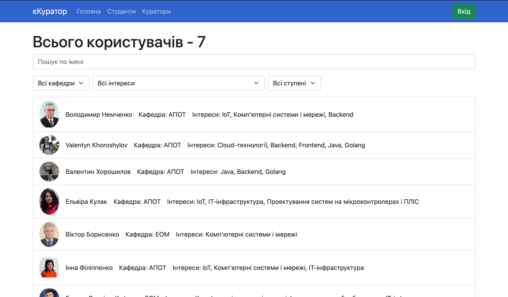
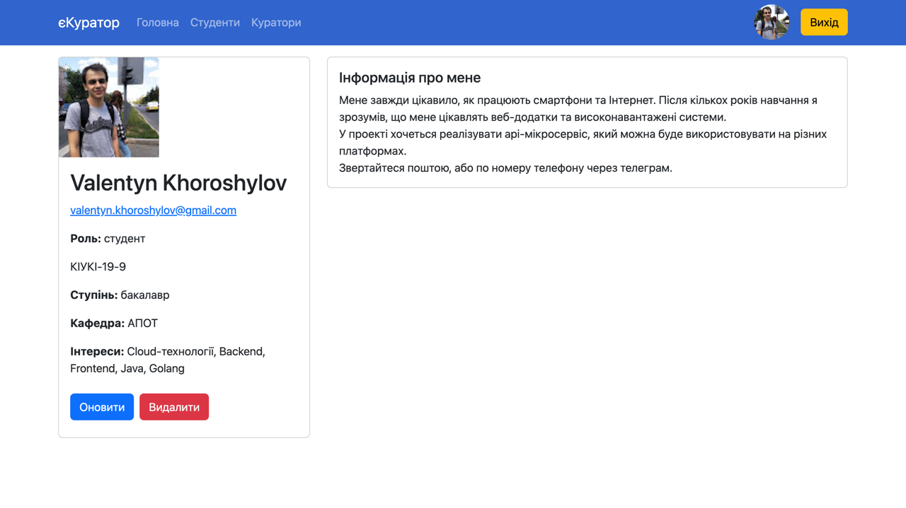
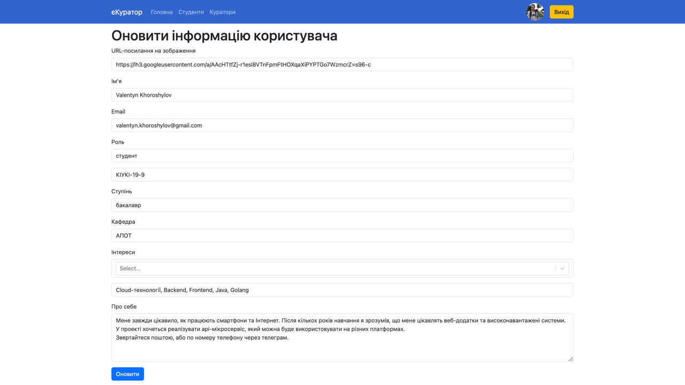
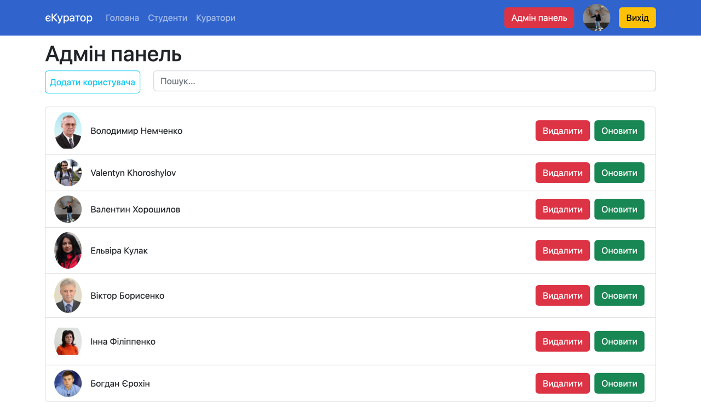

#  eKurator React Frontend App

This repository contains the frontend application for [eKurator](https://github.com/horoshi10v/apiKurator), a React-based web application. 
Ekurator is designed to provide a user-friendly interface for managing and visualizing JSON data. It serves as a client-side application that communicates with a Golang REST-API backend server.

## Screenshots

### Main Page


### User Page


### Update Page


### Admin Panel


## Prerequisites

Before running this application, ensure that you have the following prerequisites installed on your system:

- Node.js (version 12 or higher)
- npm (Node package manager)

## Installation

1. Clone this repository to your local machine:

   ```bash
   git clone https://github.com/horoshi10v/ekurator-client.git
   ```

2. Install the necessary dependencies using npm:

   ```bash
   npm install
   ```

3. Start the development server:

   ```bash
   npm start
   ```

4. The application will be accessible at `http://localhost:3000` in your browser.

## Usage

Once the application is running, you can use it to manage and visualize your data. The specific functionality and features of Ekurator will depend on the implementation of the backend server it connects to. Refer to the documentation or project requirements for more information on how to use Ekurator.

## Contributing

Contributions are welcome! If you find any issues or have suggestions for improvements, please feel free to open an issue or submit a pull request.

## License

This project is licensed under the [MIT License](LICENSE).

## Acknowledgments

This project was inspired by the need for a user-friendly data management and visualization tool. Special thanks to the contributors who have helped make this project possible.
